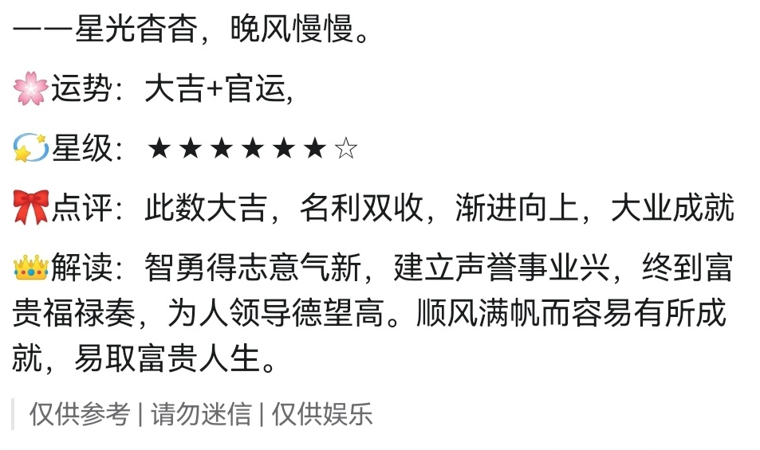

# 💬消息追加文本

#### 介绍
一个适配TRSS-Yunzai的消息追加文本插件，Miao-Yunzai可用性未做测试，自行探究。可以在触发机器人回复消息时，在消息段落的开头或者末尾添加一段自定义消息。

#### 使用方法

1.准备一个TRSS-Yunzai

2.安装本插件

如果你想让所有机器人都添加自定义消息，则安装这一个
```
curl -o "./plugins/example/消息追加文本.js" "https://gitee.com/herijian/message-append-text/消息追加文本.js"
```

如果你只是想让QQBot添加自定义消息则选择这一个
```
curl -o "./plugins/example/仅官机消息追加文本.js" "https://gitee.com/herijian/message-append-text/仅官机消息追加文本.js"
```

3.如果你想在一段消息的开头添加自定义消息，则在插件的第20行，将`end`修改为`start`


#### 效果展示


<details><summary>添加在开头~~（这个图片放错了，但我又不想再改插件测试一遍）~~</summary>


</details>

<details><summary>添加在末尾</summary>



</details>


#### 交流群

[啥都聊的交流群](https://qun.qq.com/universal-share/share?ac=1&authKey=ts39VJMNE9%2FdLZW9dQ5pFl6xqW6r3aIRM0YeX8flKTVP%2Bcv0C71YCBwEx9T4AsuL&busi_data=eyJncm91cENvZGUiOiI3NjgyMTY2ODkiLCJ0b2tlbiI6IjBwMHNmN0xydUxyWVVRcWYwTEl6UEFsV2NwNU5nejl5UThnNy9rZXFFM2kzSUNDdER3WjNtRTgwQlppSkt6LzciLCJ1aW4iOiIzNTEzMDIxNDYifQ%3D%3D&data=_tjjP1afISD-x-5RdgkHeXS41GV-qjNSfYcgMv66JVPzY03c4zRMIHA2Ynlse1oGBuWwSc7kVPxKa0-HWubjwg&svctype=4&tempid=h5_group_info)
